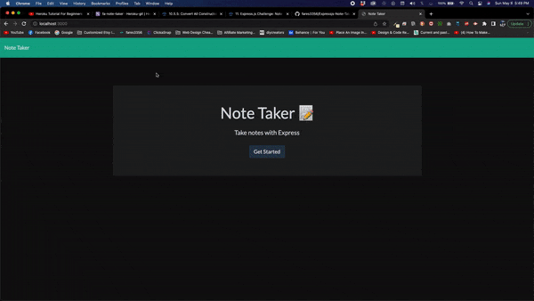

# Note Taker Using Express.js 

## Summary
The essence of this application is to allow a user take/save notes that contains a title and the note itself. This app is powered by Express.js


## Installing

Clone the repository to your local development environment.

```
git clone https://github.com/fares3356/Expressjs-Note-Taker.git
```

Navigate to the developer-profile-generator folder using the command prompt.

Run `npm install` to install all dependencies. To use the application locally, run `node server.js` in your CLI, and then open `http://localhost:3000` in your preferred browswer. 

If you want the easier way, this application is [live on Heroku](https://fa-note-taker.herokuapp.com/).

## Preview:


## Deployed Link:
[Note Taker App](https://whispering-woodland-84908.herokuapp.com/)

## Learning Points:
* This app was a practice in writing the backend code only and then integrating it with provided front end code (index.html, notes.html, and custom jQuery)
* Practice setting up an Express server and in particular learning the importance of using the express.static() function to ensure proper delivery of local js/css files used by html files being delivered via .sendFile();


## Tools Used
* [JavaScript](https://developer.mozilla.org/en-US/docs/Web/JavaScript)
* [NodeJS](https://nodejs.org/)
* Node Packages:
    * [Express](https://www.npmjs.com/package/express)

## Authors
Fares Akhtar
* [GitHub](https://github.com/fares3356)
* [LinkedIn](https://www.linkedin.com/in/fares-akhtar)

## License
This project is licensed under the ISC License.
